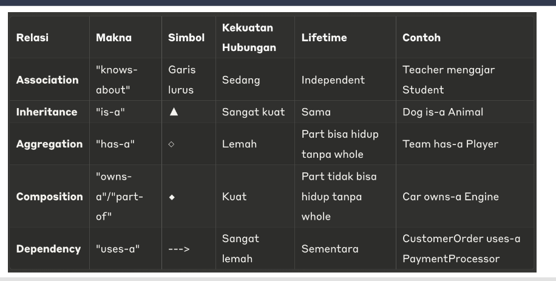

Tabel yang kamu berikan menunjukkan relasi-relasi dalam **Class Diagram** beserta makna, simbol, kekuatan hubungan, masa hidup objek, dan contoh untuk masing-masing relasi tersebut. Berikut penjelasan lebih detail untuk setiap kolom yang ada dalam tabel:

### 1. **Association ("knows-about")**

* **Makna**: Hubungan antar kelas di mana satu kelas memiliki pengetahuan atau informasi tentang kelas lainnya.
* **Simbol**: Garis lurus.
* **Kekuatan Hubungan**: Sedang – Hubungan yang lebih lemah dibandingkan dengan agregasi atau komposisi.
* **Lifetime**: Independent – Kelas-kelas yang terhubung melalui asosiasi tetap bisa eksis secara independen. Contohnya, **Teacher** mengajar **Student**, yang berarti Teacher mengetahui tentang Student, namun keduanya bisa eksis secara terpisah.
* **Contoh**: Teacher mengajar Student.

### 2. **Inheritance ("is-a")**

* **Makna**: Menunjukkan bahwa satu kelas adalah turunan atau subclass dari kelas lain (superclass). Kelas turunan mewarisi atribut dan perilaku kelas induk.
* **Simbol**: Segitiga dengan panah mengarah ke atas.
* **Kekuatan Hubungan**: Sangat kuat – Kelas turunan mewarisi semua sifat kelas induk dan memperluas atau mengubah perilaku tersebut.
* **Lifetime**: Sama – Kelas turunan dan kelas induk hidup selama keduanya ada.
* **Contoh**: Dog is a Animal – **Dog** adalah subclass dari **Animal**, mewarisi sifat dan perilaku dari kelas **Animal**.

### 3. **Aggregation ("has-a")**

* **Makna**: Menunjukkan hubungan antara bagian dan keseluruhan, di mana bagian tersebut dapat eksis tanpa keseluruhan.
* **Simbol**: Diamond terbuka di sisi kelas yang lebih besar (whole).
* **Kekuatan Hubungan**: Lemah – Kelas bagian bisa eksis meski kelas agregatnya (whole) tidak ada.
* **Lifetime**: Part bisa hidup tanpa whole – Bagian bisa eksis terpisah dari keseluruhan.
* **Contoh**: Team has-a Player – **Team** memiliki **Player**, tetapi **Player** bisa tetap eksis tanpa adanya **Team**.

### 4. **Composition ("owns-a"/"part-of")**

* **Makna**: Merupakan jenis agregasi yang lebih kuat, di mana bagian tidak dapat eksis tanpa keseluruhan.
* **Simbol**: Diamond tertutup di sisi kelas yang lebih besar (whole).
* **Kekuatan Hubungan**: Kuat – Kelas bagian tidak dapat eksis tanpa kelas agregatnya.
* **Lifetime**: Part tidak bisa hidup tanpa whole – Bagian akan hancur jika keseluruhan dihancurkan.
* **Contoh**: Car owns-a Engine – **Car** memiliki **Engine**, dan jika **Car** dihancurkan, maka **Engine** juga akan hilang.

### 5. **Dependency ("uses-a")**

* **Makna**: Menunjukkan bahwa sebuah kelas bergantung pada kelas lain untuk melakukan fungsinya.
* **Simbol**: Garis putus-putus dengan panah terbuka.
* **Kekuatan Hubungan**: Sangat lemah – Kelas yang bergantung hanya menggunakan kelas lain dalam beberapa cara, tetapi tidak mempengaruhi eksistensinya secara langsung.
* **Lifetime**: Sementara – Ketergantungan hanya berlaku selama objek tersebut sedang digunakan, dan akan berakhir saat objek selesai digunakan.
* **Contoh**: CustomerOrder uses-a PaymentProcessor – **CustomerOrder** menggunakan **PaymentProcessor** untuk memproses pembayaran, tetapi **CustomerOrder** dan **PaymentProcessor** tidak bergantung satu sama lain untuk eksistensinya secara langsung.

### Ringkasan Simbol dan Kekuatan Relasi:

* **Association**: Garis lurus (Sedang).
* **Inheritance**: Segitiga dengan panah ke atas (Sangat kuat).
* **Aggregation**: Diamond terbuka (Lemah).
* **Composition**: Diamond tertutup (Kuat).
* **Dependency**: Garis putus-putus dengan panah (Sangat lemah).

Dengan penjelasan ini, kamu bisa memahami setiap jenis relasi dalam **Class Diagram** dan tahu bagaimana cara menggambarkannya serta apa makna dan kekuatan hubungan yang ada. Semoga ini membantu untuk UTS OOP-mu!
